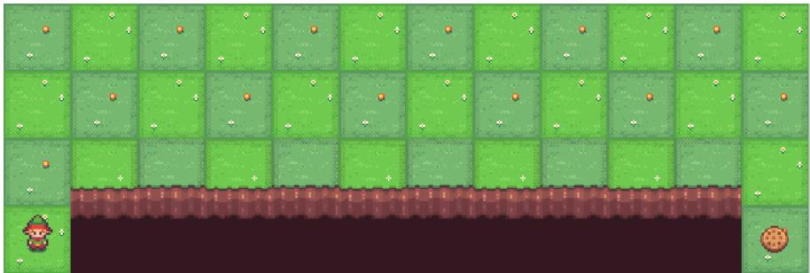
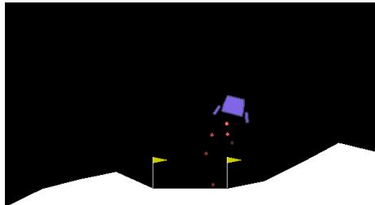

# **AI 3603 Artificial Intelligence: Principles and Techniques**

**Homework 2 Deadline:** _Nov. 16th 22:00 p.m._

Adhere to the **Code of Academic Integrity**. You may discuss background issues and general strategies with others and seek help from course staff, but the implementations that you submit must be your own. In particular, you may discuss general ideas with others but you may not work out the detailed solutions with others. It is never OK for you to see or hear another student's code and it is never OK to copy code from published/Internet sources. **Moss (Measure Of Software Similarity)** will be used for determining the similarity of programs to detect plagiarism in the class ([Moss](https://theory.stanford.edu/~aiken/moss/)). If you encounter some difficulties or feel that you cannot complete the assignment on your own, discuss with your classmates in the _Discussion forum on Canvas_, or seek help from the course staff.

You are required to complete this homework individually. Please submit your assignment following the instructions summarized in **Section 7**.

---

## **1. Reinforcement Learning in Cliff-walking Environment**

In this assignment, you will implement **Reinforcement Learning agents** to find a safe path to the goal in a grid-shaped maze. The agent will learn by trial and error from interactions with the environment and finally acquire a policy to get as high as possible scores in the game.

### **1.1 Game Description**

Suppose a $12 \times 4$ grid-shaped maze in Fig. 1. The bottom left corner is the starting point, and the bottom right corner is the exit. You can move upward, downward, leftward, and rightward in each step. You will stay in place if you try to move outside the maze. You are asked to reach the goal through the safe region and avoid falling into the cliff. Reaching the exit terminates the current episode, while falling into the cliff gives a reward `-100` and returns to the starting point. Every step of the agent is given a living cost (`-1`).



The **state space** and **action space** are briefly described as follows:

-   **State:** $s_t$ is an integer, which represents the current coordinate $(x,y)$ of the agent.
-   **Action:** $a_{t} \in \{0,1,2,3\}$, where four integers represent four moving directions respectively.

### **1.2 Implement Sarsa, Q-Learning, and Dyna-Q**

You are asked to implement agents based on **Sarsa**, **Q-Learning**, and **Dyna-Q** algorithms. Please implement the agents in `agent.py` and complete the training process in `cliff_walk_sarsa.py`, `cliff_walk_qlearning.py`, and `cliff_walk_dyna_q.py` respectively. An agent with a random policy is provided in the code. You can learn how to interact with the environment through the demo and then write your own code.

**Hint:** Take `cliff_walk_sarsa.py` as an example:

-   Line 27: More parameters need to be utilized to construct the agent, such as learning rate, reward decay $\gamma$, $\varepsilon$ value, and $\varepsilon$-decay schema.
-   Line 47: The agent needs to be provided with some experience for learning.

**Hint:** In `agent.py`:

-   You need to implement $\varepsilon$-greedy with $\varepsilon$ value decay in the `choose_action` function.
-   Functions given in the template need to be completed. You can also add other utility functions as you wish in the agent classes.

**Hint:** You should keep a balance between exploration and exploitation by tuning $\varepsilon$ value carefully. In the early stage of the training, exploration should be encouraged to get familiar with the environment. With the advancement of training, exploration may be reduced for the convergence of the policy.

### **1.3 Result Visualization and Analysis**

**Result Visualization:** You are required to visualize the training process and the final result according to the following requirements:

1. Plot the **episode reward** during the training process.
2. Plot the $\varepsilon$ value during the training process.
3. Visualize the **final paths** found by the intelligent agents after training.

**Result Analysis:** You are required to analyze the learning process based on the experiment results according to the following requirements:

1. You may find that there exists a little difference between the paths found by **Sarsa** and **Q-learning**. Please describe the difference in the report and analyze the reason in detail.
2. Analyze the training efficiency between **model-based RL (Dyna-Q)** and **model-free algorithms (Sarsa or Q-learning)**. Please describe the difference in the report and analyze the reason in detail.

---

## **2. Deep Reinforcement Learning**

### **2.1 Game Description**



This task is a classic rocket trajectory optimization problem. As shown in Fig. 2, you are required to control the space-ship and land between the flags smoothly.

In this assignment, you are required to train a **DQN agent** in `LunarLander-v2` gym environment. The definitions of **state** and **action** are given as follows:

-   **State (Array):** The state $s_t$ is an 8-dimensional vector: the coordinates of the lander in $x \& y$, its linear velocities in $x \& y$, its angle, its angular velocity, and two booleans that represent whether each leg is in contact with the ground or not.
-   **Action (Integer):** There are four discrete actions available: do nothing, fire left orientation engine, fire main engine, and fire right orientation engine.

More details of this gym environment are given in the documents of **gym**. However, information given in this file is sufficient for this assignment.

### **2.2 Read and Analyze the Deep Q-Network Implementation**

In this section, a complete **DQN implementation** `dqn.py` is given for the lunar lander task. You are required to read the code and understand the DQN training process. You are required to write comments in the code to point out the function or your understanding of each part of the code. Please fill in every `"""comments: """` (cf. `dqn.py`) with your understanding of the code.

### **2.3 Train and Tune the Agent**

In this section, you are required to train the **DQN agent**. Please show your training process (such as learning curve of episode return) and the training result (such as the game video of the final model) in the report.

The performance of the given code may be not satisfying. You need to tune the agent to get higher scores within **500000 time-steps** or make the learning process more efficient. Here are some possible ways to improve the performance:

-   _(Requested)_ Tuning the hyper-parameters of the agent, especially gamma value, epsilon value, and epsilon decay schema.
-   Tuning the structure of the Q network.
-   Utilize multiple continuous frames of the game instead of one frame each time.
-   Other ideas.

---

## **3. Improve Exploration Schema**

There exist lots of other exploration strategies except $\varepsilon$-greedy. You are asked to find and learn one new exploration method, such as **Upper Confidence Bound (UCB)**. Summarize the idea, pros, and cons of the new exploration method. Write your understanding in the report.

---

## **4. Installation**

### **4.1 Install Anaconda**

Open the address [Anaconda](https://www.anaconda.com/distribution/) and download the installer of Python 3.x version (_3.8 recommended_) for your system.

### **4.2 Install Required Environment**

After installing anaconda, open a Linux terminal and create an environment for Gym:

```bash
conda create python=3.8 --name gym
```

Then activate the environment:

```bash
conda activate gym
```

Install gym and some dependencies:

```bash
pip install gym==0.25.2
pip install gym[box2d]
pip install stable-baselines3==1.2.0
pip install tensorboard
```

Install **PyTorch**: Please follow the instructions given on the [PyTorch website](https://pytorch.org/).

---

## **5. Code, Demo Video, and Report**

-   **Code:** You can edit the code between `#### START CODING HERE ####` and `#### END CODING HERE ####`. Please **DON'T** modify other parts of the code.
-   **Demo Video:** Videos (_optional_) should be in `.mp4` format and a **10MB max** for a single file. You can compress/speed up the videos. We recommend recording videos utilizing gym wrappers: `env = gym.wrappers.RecordVideo(env, '/video')`. More information is given in the [gym docs](https://www.gymlibrary.dev/). All the videos should be put into a folder called `videos`.
-   **Report:** Summarize the process and results of the homework.

---

## **6. Discussion and Question**

You are encouraged to discuss your ideas, ask and answer questions about this homework. If you encounter any difficulty with the assignment, try to post your problem on **Canvas** for help. The classmates and the course staff will try to reply.

---

## **7. Submission Instructions**

1. Zip all your program files, experiment results, and report file `HW2_report.pdf` to a file named as `HW2_ID_name.zip`.
2. Upload the file to the **homework 2 page on Canvas**.
